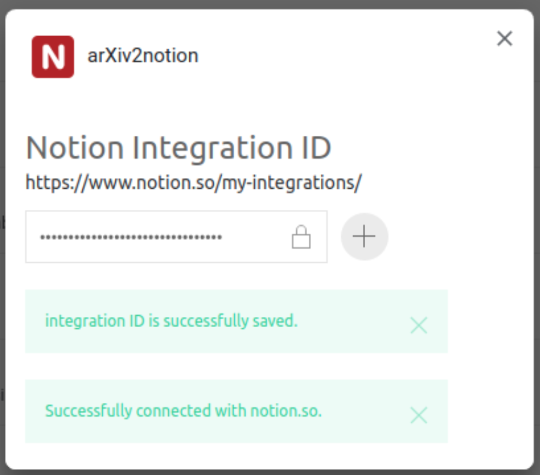

# arxiv2notion
[](https://github.com/denkiwakame/arxiv2notion/actions/workflows/build.yaml)

Easy-to-use arXiv clipper for [Notion](https://www.notion.so) based on [Notion API](https://developers.notion.com/)


## Getting Started
- login to [notion.so](https://www.notion.so) by admin user
- create databases where you save arXiv articles
  - **add properties listed below.** `Title` `URL` `Publisher` `Authors` `Abstract`
  - note that you should create *extactly the same properties with listed names.*

|property|type|
|-----|-----|
|Title|Text|
|URL|URL|
|Publisher|Select|
|Authors|Text|
|Abstract|Text|

- follow the instruction of [Notion API](https://developers.notion.com/docs/getting-started)
  - navigate to [My Integrations](https://www.notion.so/my-integrations)
  - `+ New integration`
  - associated workspace: select your workspace where you save arXiv articles
- invite the integration to target databases via `Share` -> `Invite`


## Installation
- download extension package from https://github.com/denkiwakame/arxiv2notion/releases
- for Chrome, navigate to `chrome://extension`
  - drag and drop the extension from your file manager anywhere onto the extensions page
  - or unzip the extension and `load unpacked` in developer mode

## Setup
- right-click on the extension icon > `Options`
  - copy **integration id (not the secret token!)** (see figures below) from `https://www.notion.so/my-integrations/internal/${integration-id}`
  - paste the `integration id` and click on `+` button.
  - if your entered id is valid, you can see the following callback messages.

```
In order to avoid storing Notion API key directoly onto chrome local storage,
arxiv2notion requests API token on-demand via integration ID when you are logged in.
Note that you must be logged in to notion.so when you use this extension.
```




## Build locally (for Developers)

```bash
$ git clone https://github.com/denkiwakame/arxiv2scrap.git
$ npm install
$ npm run build
$ npm run watch # debug locally
$ npm run pack  # packaging to zip
```
