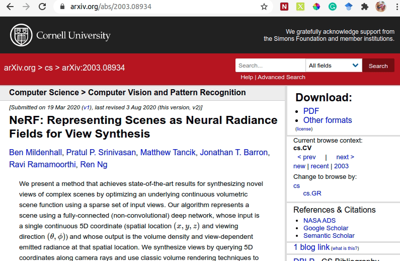
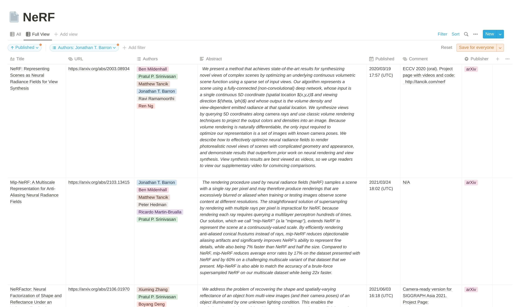
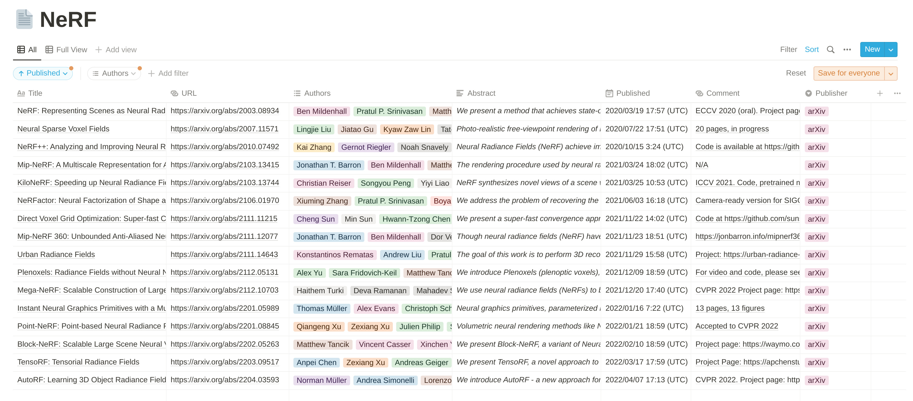
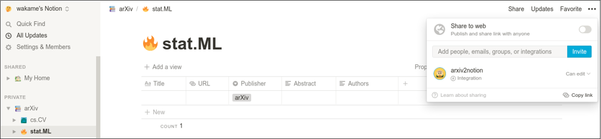
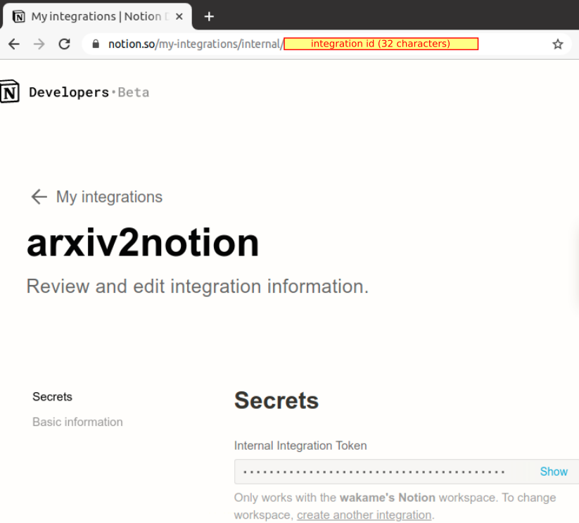

# arxiv2notion+

[](https://github.com/denkiwakame/arxiv2notion/actions/workflows/build.yaml)

Easy-to-use arXiv clipper for [Notion](https://www.notion.so) based on [Notion API](https://developers.notion.com/) (original repo: https://github.com/denkiwakame/arxiv2notion MIT License)



## More Features on arxiv2notion+
- Add the publication date for easier tracking
- Add the comment parser for quick access to the potential project homepage or code link (if available)
- Replace the author field from `text` to `multi-select` to fully leverage the search/filter in notion
- Release a public notion database/table [template](https://cheerful-alto-4ff.notion.site/b9acee8425864e1596f97bc5abc1af28?v=df28b75027154e429be566b9038e8187) to simplify the notion setup
- Support Chrome, Safari and Firefox browsers


<!--  -->


## Create databases in notion
- **The easiest approach is to clone the public template [here](https://cheerful-alto-4ff.notion.site/b9acee8425864e1596f97bc5abc1af28?v=df28b75027154e429be566b9038e8187) to your own notion workspace**
- You can create multiple databases as well for difficult type of articles

Alternatively, you can follow the following steps to create database from scratch in notion
<details>
<summary>Click here to expand!</summary> 

- login to [notion.so](https://www.notion.so) by admin user
- create databases where you save arXiv articles
  - **follow this instruction** https://www.notion.so/guides/creating-a-database , do **NOT** create a new database by `/database` !
  - **add properties listed below.** `Title` `URL` `Publisher` `Authors` `Abstract`
  - note that you should create *extactly the same properties with listed names.*

|property|type|
|-----|-----|
|Title|Title|
|URL|URL|
|Authors|Multi-Select|
|Abstract|Text|
|Published|Date|
|Comment|Text|
|Publisher|Select|

- follow the instruction of [Notion API](https://developers.notion.com/docs/getting-started)
  - navigate to [My Integrations](https://www.notion.so/my-integrations)
  - `+ New integration`
  - associated workspace: select your workspace where you save arXiv articles
- invite the integration to target databases via `Share` -> `Invite`


</details>

## Installation
- download extension package from https://github.com/wangjksjtu/arxiv2notionplus/releases
- (**Chrome**) navigate to `chrome://extensions`
  - drag and drop the extension from your file manager anywhere onto the extensions page
  - or unzip the extension and `load unpacked` in developer mode
- (**Safari**) 
  - enable develop mode in safari: `Safari` > `Preferences` > `Advanced` > check "Show Develop menu in menu bar"
  - allow unsigned extensions: `Menu bar` > `Develop` > check "Allow Unsigned Extensions"
  - unzip the extension `arxiv2notionplus.safari.zip` and click `arxiv2notion` application
  - Enable the extension from the extensions list (`Safari` > `Preferences` > `Extensions`)
- (**Firefox**) navigate to `about:debugging`
  - click `This Firefox`
  - click `Load Temporary Add-on`
  - unzip the extension `arxiv2notionplus.firefox.zip`
  - click `arxiv2notionplus.chrome.crx` in the unzipped folder

## Setup
- (**Chrome**) right-click on the extension icon > `Options`
  - copy **integration id (not the secret token!)** (see figures below) from `https://www.notion.so/my-integrations/internal/${integration-id}`
  - paste the `integration id` and click on `+` button.
- (**Safari**) right-click on the extension icon > `Manage Extension`
  - click `Always Allow on Every Website` (or allow always allow extension for `arxiv.org`) - you will see some warnings on the icon if this step is not conducted; you can also grant the permission there ;)
  - click `preferences` to enter a new page and copy **integration id (not the secret token!)**
  - paste the `integration id` and click on `+` button.
- (**Firefox**) right-click on the extension icon > `Manage Extension`
  - go to `preferences` tab and copy **integration id (not the secret token!)**
  - paste the `integration id` and click on `+` button.

**If your entered id is valid, you can see the following callback messages.**

```
In order to avoid storing Notion API key directoly onto chrome local storage,
arxiv2notion requests API token on-demand via integration ID when you are logged in.
Note that you must be logged in to notion.so when you use this extension.
```

|  integration id  | successful connection messages  |
|---|---|
|  |  |

## Build locally (for Developers)

```bash
$ git clone https://github.com/wangjksjtu/arxiv2notionplus.git
$ npm install
$ npm run build
$ npm run watch # debug locally
$ npm run pack  # packaging to zip
```

## Acknowledgement
This repo makes some small enhancements on parsing the authors/publication dates in arxiv pages. Thanks to [Mai Nishimura](https://github.com/denkiwakame) for the awesome [arxiv2notion](https://github.com/denkiwakame) repo!
